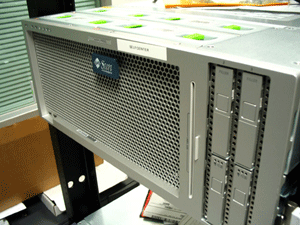
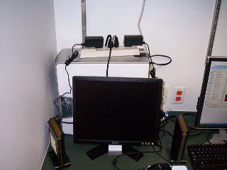

.. include:: <s5defs.txt>

====================
Using SolexaPipeline
====================

:author: Diane Trout

Purpose
-------

|  

Purpose
-------

|

.. container:: tiny

  +--------------+----------------------+----+---+----+-----+-------+--------+---+------+-----+-----+
  | :1:1:562:177 | GTTTCCGAGGCTTAACTCCN | U2 | 0 | 0  | 1   | chr11 | 32455  | F | \.\. | 17A | 22A |
  | :1:1:777:483 | GGTGGCGATTTTCTTGGTTN | U0 | 1 | 0  | 0   | chr9  | 72980  | R |      |     |     |
  | :1:1:767:493 | GGGGGACCCTGCAGTTATAN | NM | 0 | 0  | 0   |       |        |   |      |     |     |
  | :1:1:993:196 | GCTCTACTGATGTCCTCTTN | R0 | 2 | 24 | 124 |       |        |   |      |     |     |
  | :1:1:502:249 | GCCCTGGACACCACTGCTGN | NM | 0 | 0  | 0   |       |        |   |      |     |     |
  +--------------+----------------------+----+---+----+-----+-------+--------+---+------+-----+-----+

Real Purpose
------------

|

Explain how to run the pipeline

Overview
--------

  * Logistic problems 
  * Installing
  * Running
  * Problems
  * Getting ready for a new run
  * Automation 

Problems
--------

  * 500 MiB images
  * Analysis takes ~80-120 CPU hours.
  * 150 GiB for analysis and intermediate results

  .. class:: incremental

    We have small computers and we were running low on disk space

Enter CACR
----------

.. class:: center

Cellcenter

Cellcenter
----------

  * 8-core machine with 64 GiB RAM
  * Cellthumper has 17 TiB disk array
  * Running takes 8-16 hours

The Catch
---------

  * Cellcenter is across campus
  * There was a 100 Mibit bottleneck

  .. class:: incremental

    * transfer rate was ~80 Mibit.

  .. class:: incremental

    * About 12.8 hours to send one analysis

First Upgrade
-------------

  * CACR router upgrade
  * Resulted in a 100 Mibit transfer rate

  .. class:: incremental

    * A transfer then took about 10.2 hours

Second Upgrade
--------------

  * We bought a gigabit ethernet card
  * Now we get about 210 Mibit

  .. class:: incremental

    * takes about 4.8 hours

Second Upgrade
--------------

  * well really 4.8+(0-10) hours

  .. class:: incremental

    * I do sleep... 

But users want answers *NOW*
----------------------------

  * Sequencer can only copy during a chemistry cycle
  * Hard to make guarantees about transfer times 
    over the campus network

  .. class:: incremental

    * (especially when we were limited to 100 Mibit) 

Jumpgate
--------

|

Automation
----------

  * Wrote two little daemons

    .. class:: handout

      * The python daemons use:
   
        * pyinotify
        * xmpppy
        * ~diane/src/benderjab (my own personal project)
        * ~diane/proj/solexa/workflow (contains the source to the demons

      * The copy daemon runs on cellthumper and starts rsync to copy
         files from a rsyncd process on jumpgate

    * one runs on jumpgate and watches for files
    * the other listens for messages and copies files over

  .. class:: incremental

    * Now that 4.8 hours of transfer happens during the run
    * That's pretty close to NOW

Caveats
-------

  * rsync keeps rescanning directories
  * Several chemistry cycles can happen before one transfer finishes

  .. class:: incremental

    * Might be a "few" cycles left to copy after the run finishes

Running Analysis
----------------

  * Once everything is over on the analysis machine we can configure
    the analysis

SolexaPipeline
--------------

  * techsupport at illumina gives me new versions 

  .. class:: incremental

    * I'm still not convinced they'll tell people about new versions 
      when released

SolexaPipeline 0.2.2.2
----------------------

  * It couldn't finish anything other than their example run

SolexaPipeline 0.2.2.5
----------------------

  * Sometimes ran correctly

  .. class:: incremental

    * Sometimes would not complete
    * had trouble with READ_LENGTH

SolexaPipeline 0.2.2.6
----------------------

  * This one usually finishes

  .. class:: incremental

    * Though I'm not guaranteeing that finishes correctly

Installing
----------

* Available on the woldlab cluster in my home directory

.. container:: tiny

  ::

    cp ~diane/proj/solexa/SolexaPipeline-0.2.2.6.tar.gz ${WHEREVER}
    tar xzvf SolexaPipeline-0.2.2.6.tar.gz

* Read SolexaPipeline-0.2.2.6/docs/Pipeline installation.html for the rest

Running a basic analysis
------------------------

  * Make your config file
  * Run goat_pipeline.py
  * Go to “right” directory and do make
  * (wait)

GERALD Config file
------------------

* docs/GERALD User Guide and Faq.html
 
.. container:: tiny

  :: 

    GENOME_DIR /data-store01/compbio/genomes
    CONTAM_DIR /data-store01/compbio/genomes
    READ_LENGTH 32
    12345678:READ_LENGTH 32
    12345678:ANALYSIS eland
    12:ELAND_GENOME /data-store01/compbio/genomes/elegans170
    12:USE_BASES nnnnnYYYYYYYYYYYYYYYYYYYYYYYYYYY
    # <etc>
    SEQUENCE_FORMAT --scarf

GERALD Config file
------------------

  ``GENOME_DIR``
     Not sure

  ``CONTAM_DIR``
    Holds the "contamination" files like hayward_11_42bases.fa
  
GERALD Config file
------------------

    ``READ_LENGTH 32``
      "top" level ``READ_LENGTH`` is required 
      or else goat dies

GERALD Config file
------------------

* You can specify which lanes get which parameters

.. container:: tiny

  :: 

    12345678:READ_LENGTH 32
    12345678:ANALYSIS eland
    12:ELAND_GENOME /data-store01/compbio/genomes/elegans170
  
GERALD Config file
------------------

* ``12:ANALYSIS``

.. container:: small

  * ``default`` - runs phageAlign
  * ``none`` - ignores the lanes
  * ``eland`` - aligns sequence to a genome
  * ``monotemplate`` - haven't used
  * ``expression`` - for "counting occurrence of sequence tags"
  * ``sequence`` - doesn't align, just returns sequence

GERALD Config file
------------------

* ``12:USE_BASES nnnnnYYYYYYYYYYYYYYYYYYYYYYYYYYY``

  .. container:: small

    * the number of N/Ys must match READ_LENGTH
    * allows one to ignore specific bases

GERALD Config file
------------------

* ``SEQUENCE_FORMAT``

  .. container:: small

    * ``fasta``
    * ``fastq`` 
    * ``scarf`` (solexa machine specific)

GERALD Config file
------------------

  * There are more options, which I haven't used

Goat
----

* docs/Goat documentation - Firecrest, Bustard.html
* the minimal goat command

  .. container:: tiny

    :: 

      ~/proj/SolexaPipeline-0.2.2.6/Goat/goat_pipeline.py \\
      --GERALD=config32dt.txt  \\
      --phasing=auto1 \\
      --cycles=auto \\
      --make .

Goat
----

* where is the executable

  .. container:: small

     ~/proj/SolexaPipeline-0.2.2.6/Goat/goat_pipeline.py

Goat
----

* pathname to the config file you created

  ::

     --GERALD=config32dt.txt

Goat
----

* The image processor needs to estimate "phasing" paramaters::

      --phasing=auto1

* Uses lane 1 to try and estimate

.. class:: incremental

  ``--phasing=auto4`` for lane4

Goat
----

* Let goat guess how many cycles the sequencer ran for

::

    --cycles=auto

.. class:: incremental

  :: 

    --cycles=3-10

.. class:: incremental

  
   ``--cycles=4`` - only uses one cycle

Goat
----

* actually tell goat to generate all of the makefiles

 ::

   --make

Goat
----

* Tell goat where to put the Data directory

  ::

    .

.. class:: handout

  * I usually run goat from the root of the analysis directory
  * On cellcenter that ends up being something like
    /zpool1/compbio/diane/sequencer/070815_USI-EAS44_0016_FC7284/

    (meaning I was running goat in the analysis directory written out by the sequencer)

Make
----

* Make is a tool commonly used by unix programmers
* It encodes "dependencies" between files 
* For instance

::

  homework1: homework1.c
      gcc -o homework1 homework1.c

.. class:: handout

  * When you change the homework1.c make knows it needs to run 
    gcc to turn the source file (homework1.c) into an executable (homework1)

Make
----

* Having the pipeline use make makes it easy for them to use parallel machines with

  :: 

    make -j<number of simultaneous commands to run>

* On cellcenter with 8 cpus I typically do

  ::

    make -j8

Make
----

* The pipeline is actually made up of at least  3 seperate processing steps

  * Firecrest - image processing
  * Bustard - base calling
  * GERALD - runs sequence analysis

Make
----

  .. class:: handout
 
     Each pipeline step goes into a subdirectory of the previous

  * Firecrest/Bustard/GERALD

Make
----

.. container:: small

  * ``070815_USI-EAS44_0016_FC7284/``

    * ``Data/``

      * ``C1-36_Firecrest1.8.28_18-08-2007_diane/``

        * ``Bustard1.8.28_18-08-2007_diane/``

           * ``GERALD_18-08-2007_diane``
    
Make
----

* To actually get the SolexaPipeline to generate everything I do

.. container:: tiny

 ::

    $ cd 070815_USI-EAS44_0016_FC7284
    $ .../goat_pipeline ...
    $ cd Data/C1-36_Firecrest1.8.28_18-08-2007_diane
    $ make -j8 recursive ; xsend diane@... make stopped

Make
----

* Each of those directories contains thousands of files

  * Firecrest - 3,221
  * Bustard - 6,430
  * GERALD - 22,495

Make
----

* Each tile produces one "image" file
* Each pipeline step might produce several files for each tile
* The subsequent pipeline steps depend on the files in the previous directory

Breakage
--------

* when a command aborts

  * "make tidy"

    * cleans files that were started but not actually generated (empty)
    
Breakage
--------

* Sometimes your config file has the wrong options
* Easy way to fix...

  * Fix the config file
  * Blow away the Firecrest directory and everything under it
  * start over with goat 

.. class:: incremental::

  * Unfortuantely that takes the full 12-16 hours to rerun everything

Breakage
--------

* The harder way to fix
* Make a new config file or fix your first config file
  
.. container:: tiny

  ::

    cd  ..Firecrest../..Bustard..

* Run GERALD directly

.. container:: tiny

  ::

    ${SPP}/GERALD.pl config.txt ../../config10dt.txt \
                     --EXPT_DIR $(pwd) \
                     --FORCE
    cd GERALD_<new date>_diane

.. container:: small

  * Hope the new directory name differs from the previous name

.. container:: tiny

  ::

    make -j8
 
Breakage
--------

* Now you have a second GERALD directory in your Bustard directory
* That adds another 28 GiB to your analysis directory
* 750 GB drives currently have the best GB/$

Breakage
--------

* 750 GB drives actually hold 699 GiB
* The images are about 451 GiB
* The analysis is about 153 GiB

.. class:: incremental

  * 451+153 = 604

.. class:: incremental

  * 699 - 604 = 95

.. class:: incremental

  * 95 / 28 ~= 3

.. class:: incremental

  * not much room for partial re-runs

Sharing the Analysis
--------------------

* I started off copying all the results back
* 153 GiB = 1.6 hours
* Now I copy the eland results files back over first

Sharing the Analysis
--------------------

* The GERALD directory has several html files in it

.. container:: tiny

  ``All.htm`` ``Hist.htm`` ``IVC.htm`` ``Summary.htm``
  ``Error.htm`` ``Info.htm`` ``Perfect.htm`` ``Tile.htm``

* ``Summary.htm`` is safe
* Several of the others try loading an image for every tile in the analysis
* This makes my computer unhappy as Firefox tries to eat all my ram

Sharing the Analysis
--------------------

* Save the results to the external drive
* Put the drive on myod

  * Share them off of a "private" webserver

.. class:: incremental

  * It's only secure through obscurity
  * Should probably add user/name password 

Sharing the analysis
--------------------

* rsync everything from cellcenter to here
* catch any changes the pipeline made
* ``cellcenter $ rm -rf 070815``
* Put the drive in a box and back on the shelf

.. class:: incremental 

  (this part could be worked out better)

Prepping the hard drive
-----------------------

  * Plug it in to jumpgate
  * Turn off power management
  * Change partition table
  * Reformat
  * Mount
  * possibly restart samba
  * change permissions
  * test writing from the sequencer

Prepping the hard drive
-----------------------

  * We're using Seagate Freeagent Pro 750 GB drives
  * They have an annoying tendancy to spin down and make linux cranky
  
Prepping the hard drive
-----------------------

* Turning off the drives power management

  * plugged in via a SATA

  .. container:: small

    ::

      hdparam -S 0 /dev/sd?

  * when it's plugged in via USB

  .. container:: small

    ::

      sdparam --clear STANDBY -6 /dev/sd?

Prepping the hard drive
-----------------------

* change the partition table

  * ``fdisk /dev/sd?``
  * toggle type from NTFS to Linux
  * t 83

Prepping the hard drive
-----------------------

* Reformat

  * ``mkfs -t xfs /dev/sd?1``
  * xfs says
    "hey there's a filesystem here"
  * if it says NTFS we have a new drive
  * ``mkfs -t xfs -f /dev/sd?1``

Prepping the hard drive
-----------------------
 
* mount

  ::

    mount /dev/sd?1 /gec/jumpgate/ext0

Prepping the hard drive
-----------------------

* change permissions

  :: 

    chmod 1777 /gec/jumpgate/ext0

.. class:: handout

  * those are the permissions used for the /tmp directory

Prepping the hard drive
-----------------------

* go to the sequencer

  * load explorer
  * Location: ``\\192.168.126.2\ext0``
  * try make a file and try to save it
  * username: ``sequencer``
  * password: ``********``

Yay
---

.. class:: incremental

  * If you've been following along...
  * you now know as much I know about the pipeline
  * (At least close enough)

DIY
---

* request an account on cellcenter

.. container:: small

  http://www.cacr.caltech.edu/resources/accounts/index.cfm

* ``/zpool1/compbio/diane/sequencer`` for the solexa files
* ``/data-store01/compbio/diane`` for the genome files

Automation
----------

* Shoveling around large chunks of data is dull

.. class:: incremental

  * Maybe someone else can do it
  * More likely, no one will
  * Perhaps automation will save me

Automation
----------

* Tool to generate config files
* Probably on jumpgate
* And add the config file to the package sent to cellcenter

Automation
----------

* once there hopefully I can get goat and make to run automatically

Automation
----------

* Then send the files back

Automation
----------

* I'm not sure I want to automate deleting the analyses

Automating
----------

* I don't think I can automate moving the hard drives around

.. class:: incremental

  (at least on our budget)

Automating
----------

* There's still the problem of rerunning an analysis when something goes wrong.

Done
----

Binary units
------------

* KB  = kilobyte which if you're using SI units should mean 1000 bytes
* But computers work in powers of two, not ten.

.. class:: incremental

  * 2 ^ 10 ~= 10 ^ 3
  * 1024 ~= 1000

Binary units
------------

+----------+---------+---------------+---------+
| Name     | Base 2  | Size          | Base 10 |
+----------+---------+---------------+---------+
| megabyte | 2 ^ 20  | 1048576       | 10 ^ 6  |
+----------+---------+---------------+---------+
| gigabyte | 2 ^ 30  | 1073741824    | 10 ^ 9  |
+----------+---------+---------------+---------+
| terabyte | 2 ^ 40  | 1099511627776 | 10 ^ 12 |
+----------+---------+---------------+---------+

Binary Units
------------

* To resolve the ambiguity the IEC invented "Binary SI"

+------+------------+
| Name | Power of 2 |
+------+------------+
| Kibi | 2 ^ 10     |
+------+------------+
| Mebi | 2 ^ 20     |
+------+------------+
| Gibi | 2 ^ 30     |
+------+------------+
| Tebi | 2 ^ 40     |
+------+------------+

  
Hard Disk Units
---------------

* Hard disk manufacturers always use the powers of 10 
  never 2 ^ (x * 10)

  * It makes their drives sound bigger

* Computers always report 2 ^ (x * 10) 
* Thus the computer always says its smaller than whats on the box
* Plus the filesystem has some overhead
